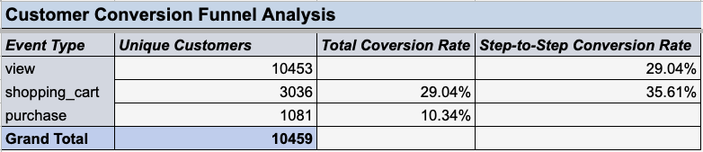
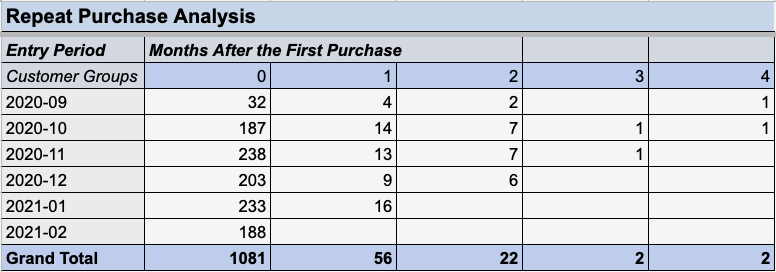
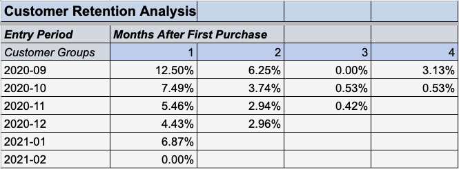

# E-Commerce Customer Conversion & Retention Analysis

## Project Overview

This project demonstrates advanced Excel analytical skills by transforming raw e-commerce event logs into actionable business insights. As part of a business analytics initiative, I analyzed customer behavior patterns across the purchase journey, from initial product views through repeat purchases, to provide data-driven recommendations for improving conversion rates and customer retention.

**Key Skills Demonstrated:** Advanced Excel Functions (VLOOKUP, TEXT, DATEDIF), Pivot Tables, Cohort Analysis, Funnel Analysis, Data Cleaning & Preparation, Business Metrics Development

---

## Business Problem

The e-commerce company needed to understand two critical aspects of their customer behavior:

1. **Conversion Efficiency**: How effectively does the website convert product page views into actual purchases?
2. **Customer Retention**: Are customers returning to make repeat purchases, and how does retention vary by acquisition cohort?

Without clear visibility into these metrics, the company couldn't identify where customers were dropping off in the purchase journey or which customer cohorts were most valuable over time.

---

## Dataset

The analysis used raw user activity logs containing **4,845 purchase transactions** across a 6-month period (September 2020 - February 2021). 

**Data Structure:**
- `user_id`: Unique customer identifier
- `event_type`: Type of user activity (view, shopping_cart, purchase)
- `category_code`: Product category
- `brand`: Product manufacturer
- `price`: Product price in USD
- `event_date`: Date of activity (YYYY-MM-DD format)

---

## Analytical Approach

### 1. Conversion Funnel Analysis

**Objective:** Quantify the customer journey from product discovery to purchase completion.

**Methodology:**
- Built a three-stage funnel tracking unique users through: Product View → Shopping Cart → Purchase
- Calculated both overall conversion rates and step-to-step conversion rates
- Used pivot tables to count distinct customers at each funnel stage

**Technical Implementation:**
- Created pivot table grouping unique users by `event_type`
- Applied formulas to calculate conversion percentages between stages
- Ensured each user was counted only once per stage

---

### 2. Cohort-Based Retention Analysis

**Objective:** Measure customer retention over time, segmented by month of first purchase.

**Methodology:**
This analysis required extensive data preparation and transformation:

**Step 1: Data Filtering & Preparation**
- Isolated purchase events from the raw activity log (filtered out views and cart additions)
- Created separate `purchase_activity` dataset with 4,845 purchase records

**Step 2: First Purchase Date Calculation**
- Used pivot tables to identify each customer's first purchase date
- Applied VLOOKUP function to append first purchase dates to the purchase activity data

**Step 3: Temporal Data Engineering**
- Created `event_month` and `first_purchase_month` columns using TEXT() function (YYYY-MM format)
- Calculated `cohort_age` using DATEDIF() function to measure months between first purchase and subsequent purchases
- Cohort ages ranged from 0 (first purchase month) to 4 months

**Step 4: Cohort Aggregation & Retention Calculation**
- Grouped customers into 6 acquisition cohorts based on first purchase month (Sept 2020 - Feb 2021)
- Tracked unique customer counts at each monthly interval (cohort ages 0-4)
- Calculated retention rates by dividing returning customers by initial cohort size

**Technical Implementation:**
- Multiple pivot tables to aggregate purchase counts by cohort and age
- Fixed column references in retention rate formulas to enable efficient copying across the analysis grid
- Validated that first purchase dates never exceeded subsequent purchase dates

---

## Key Findings

### Conversion Funnel Results

- **Overall Conversion Rate: 10.34%** of users who viewed products completed a purchase
- **View to Cart Rate: 29.04%** of product viewers added items to their shopping cart
- **Cart to Purchase Rate: 35.61%** of users who added items to cart completed checkout

**Insight:** The biggest drop-off occurs between viewing products and adding to cart (71% abandon). However, once users add items to cart, they're relatively likely to complete the purchase.

**Recommendation:** Focus optimization efforts on the view-to-cart transition through improved product pages, clearer value propositions, and trust signals.

---

### Customer Retention Results

- **Highest Month 1 Retention: 12.50%** (September 2020 cohort)
- **Most Cohorts:** Showed retention rates below 10% in the first month after initial purchase
- **Retention Decline:** Significant drop-off across all cohorts after the first month, with most cohorts showing <5% retention by month 2

**Insight:** Customer retention is critically low across all cohorts. Even the best-performing cohort (Sept 2020) retained only 12.5% of customers by the first month, dropping to 6.25% by month 2.

**Recommendation:** Implement a post-purchase engagement strategy including:
- Email remarketing campaigns for the 30-60 day window
- Loyalty program to incentivize repeat purchases
- Personalized product recommendations based on first purchase category
- Win-back campaigns for customers who haven't returned after 2 months

---

## Technical Skills Showcased

### Excel Functions & Formulas
- **VLOOKUP**: Merged first purchase dates across datasets
- **TEXT()**: Converted dates to YYYY-MM format for monthly grouping
- **DATEDIF()**: Calculated time intervals between purchases in months
- **Relative & Absolute Cell References**: Enabled efficient formula copying in retention rate calculations

### Data Analysis Techniques
- **Pivot Tables**: Multiple pivot tables for aggregation and analysis
- **Data Filtering & Cleaning**: Isolated relevant event types for focused analysis
- **Cohort Analysis**: Time-based customer segmentation and behavioral tracking
- **Funnel Analysis**: Sequential conversion tracking with dropout rates

### Business Analytics
- Translated raw event logs into actionable KPIs
- Identified specific business opportunities (view-to-cart optimization, retention programs)
- Structured analysis with executive summary and clear documentation

---

## Project Organization

The Excel workbook is organized following professional best practices:

1. **Executive Sheets**: Table of Contents, Executive Summary
2. **Analysis Results**: Conversion Funnel, Repeat Purchase Analysis, Customer Retention Analysis
3. **Calculation Sheets**: First Purchases, Purchase Activity, Cohort Analysis
4. **Raw Data**: Total User Activity

All sheets include:
- Formatted headers with bold text and borders
- Frozen top rows for easy navigation
- Consistent date and number formatting
- Clear labels and documentation

---

## Files in This Repository

- `README.md` - This file, providing complete project documentation
- `Business_Analytics_Project.xlsx` - Complete Excel workbook with all analyses
- `customer_conversion_funnel_analysis.png` - Screenshot of conversion funnel results
- `repeat_purchase_analysis.png` - Screenshot of repeat purchase cohort data
- `customer_retention_analysis.png` - Screenshot of retention rate calculations

---

## How to Use This Project

1. Download the Excel file to explore the complete analysis
2. Navigate through the sheets in order (starting with Table of Contents)
3. Review the Executive Summary for high-level findings
4. Examine the analytical sheets to see methodology and calculations
5. Explore the raw data and calculation sheets to understand the data transformation process

---

## Business Impact

This analysis provides the foundation for two major business initiatives:

1. **Conversion Rate Optimization Program**: Data-driven prioritization focusing on the view-to-cart stage, with potential to significantly increase the current 10.34% overall conversion rate

2. **Customer Retention Strategy**: Evidence-based retention marketing plan targeting the critical 30-60 day window where most customers currently churn

By transforming raw event logs into clear, actionable metrics, this project demonstrates the ability to drive business value through analytical thinking and technical Excel proficiency.

---

## Author

**Richard Rivera Cartagena**  
[(https://www.linkedin.com/in/richard-rivera-cartagena/)] | [(https://github.com/RichRC)]

*This project was completed as part of a business analytics portfolio to demonstrate advanced Excel skills and analytical problem-solving capabilities.*
